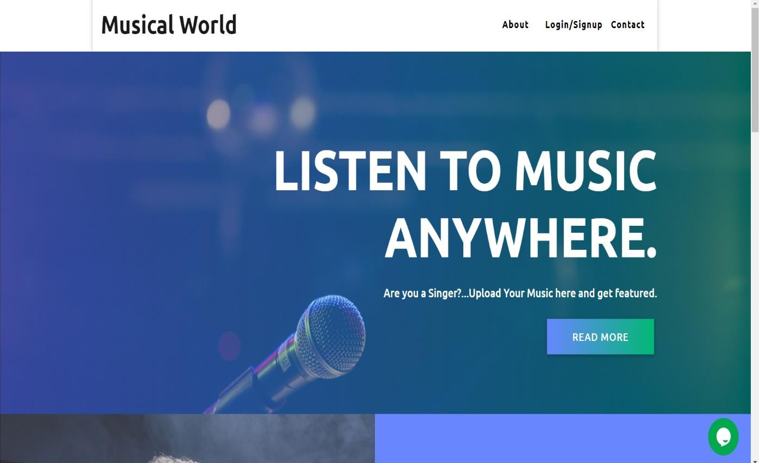

# MusicalWorld
Developed an website named MusicalWorld using Django, HTML/CSS and JavaScript. It let's users upload music freely unlike other platforms (i.e; Spotify, Gaana, Savan...) which have certain requirements.

# Homepage

# Login Panel

# Registeration Panel

# Admin Page

# User Homepage

# User Track Page

